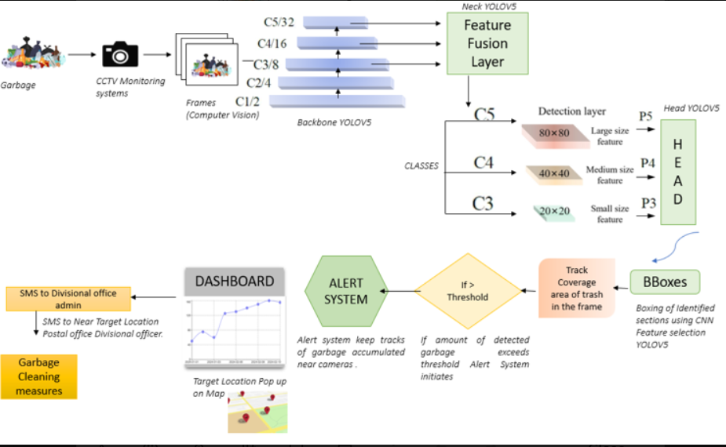
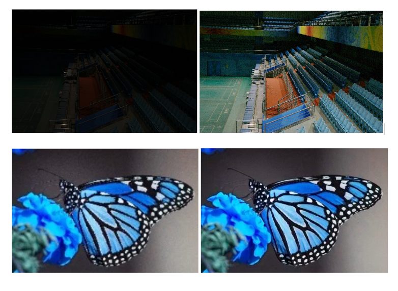
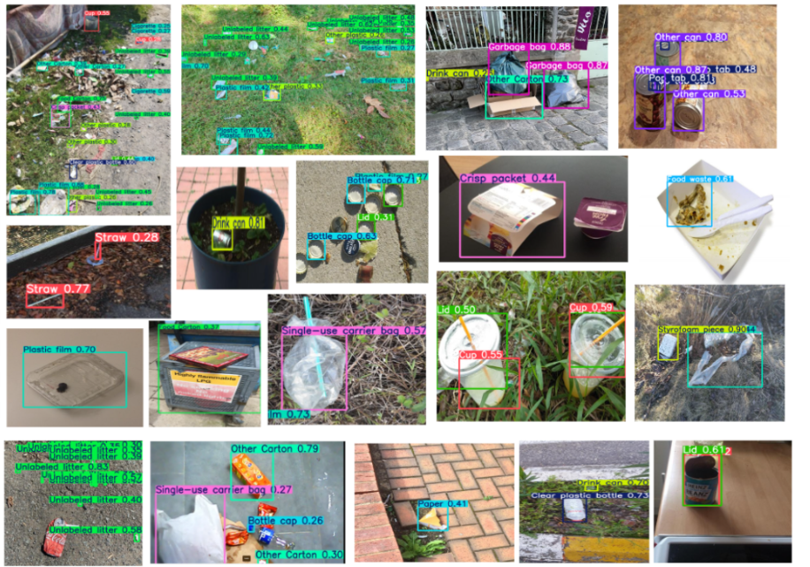
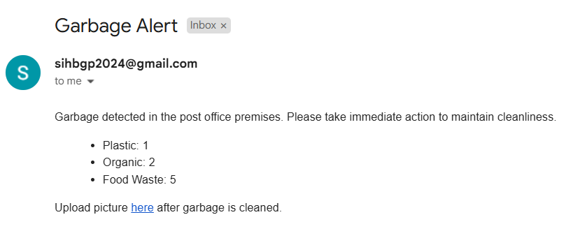
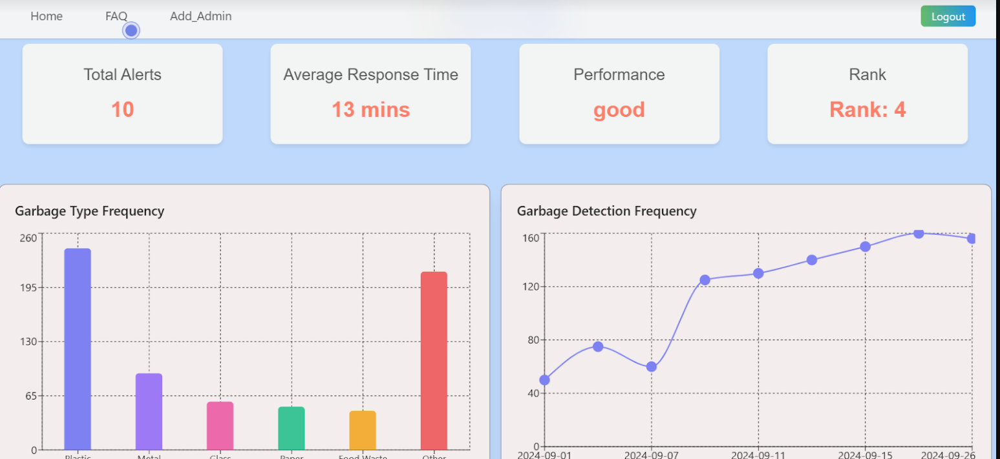

# 🚮 CleanVision ✨  
**Automated Garbage Detection and Alert System with Live Dashboard for Post Offices using YOLOv5**

CleanVision is an AI-powered computer vision system developed during the **Smart India Hackathon (SIH)** to enhance cleanliness monitoring in post office environments. Leveraging the capabilities of **YOLOv5**, the system detects various garbage items in real-time surveillance footage, triggers alerts, and offers actionable insights via an interactive dashboard.

The project promotes **hygiene**, **accountability**, and **transparency** in postal divisions through intelligent automation.

---

## 📸 How YOLOv5 Works

YOLOv5 (You Only Look Once v5) is a state-of-the-art object detection model:

- 🔲 **Grid-Based Detection**: Divides image into cells to detect objects in each.
- 📦 **Bounding Box Prediction**: Outputs coordinates & confidence scores.
- 🏷️ **Class Prediction**: Identifies object types like plastic, paper, metal, etc.
- 🧹 **NMS Filtering**: Removes overlapping predictions.
- ✅ **Final Output**: Only the most confident, accurate detections are displayed.

  

---

## ⚙️ Object Detection Model Training (YOLOv5)

- **Model**: YOLOv5-m (medium configuration)
- **Preprocessing**: Image resizing, normalization
- **Training Pipeline**:
  - Annotated via Roboflow
  - Finetuned using PyTorch with COCO-pretrained weights
  - Augmentations: random scale, flip, brightness
- **Real-Time Capable**: Up to ~30 FPS on GPU

📁 _Training notebooks are available in the `./ipynb training_files` directory._

---

## 🔁 Workflow Diagram

  

---

## 🚀 First-Time Setup & Model Launch

- Upon signing up, users download `Launch AI Model.py` from the dashboard.
- The script:
  - Accepts or captures image input
  - Runs the YOLOv5 model locally
  - Returns predictions and displays results

> 🛡️ This design ensures model execution is performed locally, avoiding real-time hosting, improving **privacy** and reducing **infrastructure load**.

---

## 🧪 Sample Model Results

- **Input**: Live video feed (frames uploaded to Firebase)
- **Processing**: YOLOv5 detection on server (Render)
- **Output**:
  - 📬 Email alert to local post office
  - 📈 Updates metrics on dashboard

---

## 📊 Evaluation Metrics

Tested on 532 images with 462+ annotated garbage instances.

| Metric             | Score |
|--------------------|-------|
| **Precision (P)**  | 0.96  |
| **Recall (R)**     | 0.95  |
| **mAP@0.5**        | 0.975 |
| **mAP@0.5:0.95**   | 0.89  |

✔️ High detection accuracy and robustness, even under complex environmental conditions.

---

## 💡 Optimization Layer: MIRet for Dim-Light Detection

In low-light scenarios, YOLO may underperform. To combat this, we integrated:

### 🌙 MIRet: Multi-Illumination Retention Module

- Enhances brightness, contrast, and detail in dim lighting
- Uses histogram equalization + residual filters
- Boosts model performance by 27% in low-light images

  

---

## 🗂️ Dataset Sample

  

🔗 [View Dataset on Kaggle](https://www.kaggle.com/datasets/nidhisatyapriya/cleanliness-monitoring)

---

## 📊 Dashboard Integration & ✉️ Alert Generation

<table>
  <tr>
    <td align="center"><strong>🚨 Alert Email</strong></td>
    <td align="center"><strong>📈 Dashboard Overview</strong></td>
  </tr>
  <tr>
    <td align="center">
      
    </td>
    <td align="center">
      
    </td>
  </tr>
</table>

---

## 🤝 Contributors

**Team CleanVision** – Finalists at Smart India Hackathon 2024

> Abhijeet, Souvik, Nidhi, Shraddha, Rahul, Arzu

---

## 📄 License

This project is licensed under the **MIT License**.
